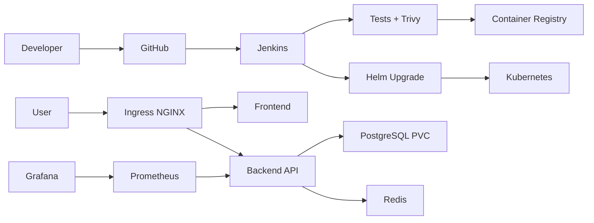

# CloudCart DevOps Platform


      
  
  
      

Production-oriented DevOps and Kubernetes learning project for deploying a small e-commerce workload end to end.

CloudCart includes:

- Containerized frontend and backend applications
- Kubernetes deployment with Helm
- PostgreSQL StatefulSet with persistent storage
- Redis cache
- Ingress, HPA, PDB, RBAC, ConfigMaps, Secrets, and NetworkPolicies
- Jenkins CI/CD pipeline
- Prometheus, Grafana, Alertmanager, and application metrics
- Trivy image scanning and operational runbooks
- Backup, rollback, and troubleshooting scripts

## Architecture



## Quick Start

1. Build and test locally:

   ```bash
   cd app/backend
   npm test
   npm start
   ```

2. Build images:

   ```bash
   docker build -t cloudcart-backend:local app/backend
   docker build -t cloudcart-frontend:local app/frontend
   ```

3. Run the redesigned frontend with Docker:

   ```bash
   docker network create cloudcart-network
   docker run -d --name cloudcart-backend --network cloudcart-network cloudcart-backend:local
   docker run -d --name cloudcart-frontend --network cloudcart-network -p 8080:80 cloudcart-frontend:local
   ```

   Open:

   ```text
   http://localhost:8080
   ```

4. Deploy with Helm:

   ```bash
   helm upgrade --install cloudcart helm/cloudcart \
     --namespace cloudcart \
     --create-namespace \
     --set backend.image.repository=cloudcart-backend \
     --set backend.image.tag=local \
     --set frontend.image.repository=cloudcart-frontend \
     --set frontend.image.tag=local
   ```

5. Verify:

   ```bash
   kubectl get pods -n cloudcart
   kubectl get ingress -n cloudcart
   ```

## Main Endpoints

- `GET /healthz`: liveness probe
- `GET /readyz`: readiness probe
- `GET /metrics`: Prometheus metrics
- `GET /api/products`: product catalog
- `POST /api/orders`: create an order

## Recommended Repository Flow

- `main`: production-ready code
- `develop`: integration branch
- `feature/*`: feature work
- Jenkins builds immutable image tags as `BUILD_NUMBER-GIT_SHORT_SHA`
- Helm performs atomic upgrades and rollback on failure

## Documentation

- [Architecture](docs/architecture.md)
- [Runbook](docs/runbook.md)
- [Jenkins Setup](docs/jenkins-setup.md)
- [Interview Notes](docs/interview-notes.md)
- [Trivy Policy](security/trivy-policy.md)
