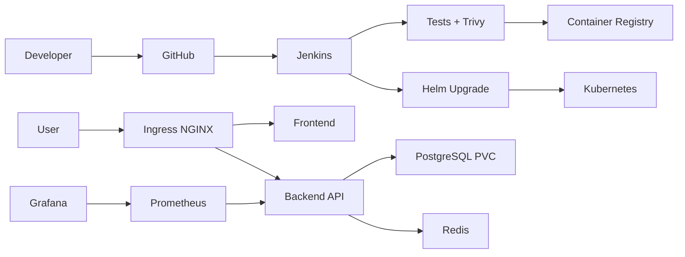
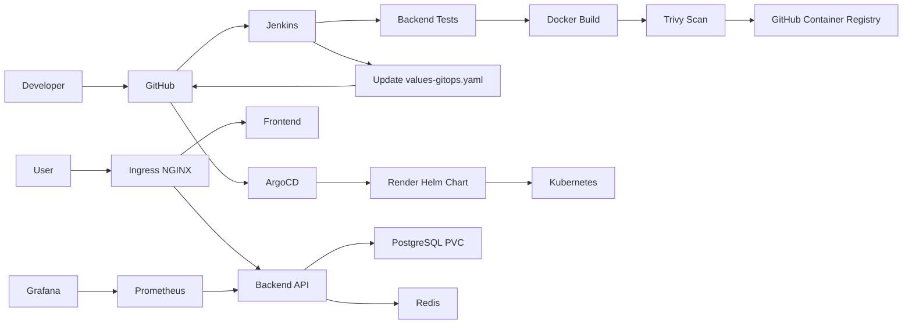

# CloudCart DevOps Platform


Production-oriented DevOps and Kubernetes learning project for deploying a small e-commerce workload end to end.

This repository is organized branch-wise to show two deployment approaches:

| Branch | Purpose | Deployment Model |
|--------|---------|------------------|
| `helm` | Kubernetes deployment using Helm from Jenkins | Jenkins builds, scans, pushes images, and deploys the Helm chart directly |
| `argocd` | GitOps deployment using ArgoCD | Jenkins builds, scans, pushes images, updates Git, and ArgoCD deploys from Git |

CloudCart includes:

- Containerized frontend and backend applications
- Kubernetes deployment with Helm
- GitOps deployment with ArgoCD on the `argocd` branch
- PostgreSQL StatefulSet with persistent storage
- Redis cache
- Ingress, HPA, PDB, RBAC, ConfigMaps, Secrets, and NetworkPolicies
- Jenkins pipeline for CI, image scanning, image publishing, and deployment promotion
- Prometheus, Grafana, Alertmanager, Loki, Promtail, application metrics, and pod logs
- Trivy image scanning and operational runbooks
- Kyverno policy enforcement for admission-time platform guardrails
- Backstage catalog metadata and TechDocs setup
- Backup, rollback, and troubleshooting scripts

## Architecture Options

### Helm Branch



### ArgoCD Branch



## Quick Start

Choose the branch based on the deployment model you want to run.

For Helm-based Kubernetes deployment:

```bash
git checkout helm
```

For ArgoCD-based GitOps deployment:

```bash
git checkout argocd
```

1. Build and test locally:

   ```bash
   cd app/backend
   npm test
   npm start
   ```

2. Build images:

   ```bash
   docker build -t cloudcart-backend:local app/backend
   docker build -t cloudcart-frontend:local app/frontend
   ```

3. Run the redesigned frontend with Docker:

   ```bash
   docker network create cloudcart-network
   docker run -d --name cloudcart-backend --network cloudcart-network cloudcart-backend:local
   docker run -d --name cloudcart-frontend --network cloudcart-network -p 8080:80 cloudcart-frontend:local
   ```

   Open:

   ```text
   http://localhost:8080
   ```

4. Deploy with Helm on the `helm` branch:

   ```bash
   helm upgrade --install cloudcart helm/cloudcart \
     --namespace cloudcart \
     --create-namespace \
     --set backend.image.repository=cloudcart-backend \
     --set backend.image.tag=local \
     --set frontend.image.repository=cloudcart-frontend \
     --set frontend.image.tag=local
   ```

5. Deploy with ArgoCD on the `argocd` branch:

   ```bash
   argocd app create cloudcart \
     --repo https://github.com/Pushpendra2601/CloudCart-Ecomm.git \
     --revision argocd \
     --path helm/cloudcart \
     --dest-server https://kubernetes.default.svc \
     --dest-namespace cloudcart \
     --values values.yaml \
     --values values-gitops.yaml \
     --sync-option CreateNamespace=true
   ```

   ```bash
   argocd app sync cloudcart
   argocd app wait cloudcart --health --timeout 300
   ```

6. Verify:

   ```bash
   kubectl get pods -n cloudcart
   kubectl get ingress -n cloudcart
   ```

## CI/CD and GitOps Flow

The project demonstrates two delivery patterns.

On the `helm` branch:

1. Jenkins checks out the repository.
2. Jenkins runs backend tests.
3. Jenkins builds backend and frontend Docker images.
4. Jenkins scans images with Trivy.
5. Jenkins pushes immutable tags to GitHub Container Registry.
6. Jenkins deploys the Helm chart directly to Kubernetes.
7. Jenkins verifies rollout status.

On the `argocd` branch:

1. Jenkins checks out the repository.
2. Jenkins runs backend tests.
3. Jenkins builds backend and frontend Docker images.
4. Jenkins scans images with Trivy.
5. Jenkins pushes immutable tags to GitHub Container Registry.
6. Jenkins updates `helm/cloudcart/values-gitops.yaml` with the new image tag.
7. Jenkins commits and pushes the GitOps change.
8. ArgoCD detects the Git change and syncs Kubernetes.

## Main Endpoints

- `GET /healthz`: liveness probe
- `GET /readyz`: readiness probe
- `GET /metrics`: Prometheus metrics
- `GET /api/products`: product catalog
- `POST /api/orders`: create an order

## Recommended Repository Flow

- `helm`: Helm-based Kubernetes deployment flow
- `argocd`: GitOps deployment flow with ArgoCD
- Jenkins builds immutable image tags as `BUILD_NUMBER-GIT_SHORT_SHA`
- Helm branch deploys directly with Helm
- ArgoCD branch deploys by updating Git and letting ArgoCD reconcile Kubernetes state
- Rollback in the Helm flow is handled through Helm release history
- Rollback in the GitOps flow is handled through Git revert or ArgoCD sync history.

## Documentation

- [Architecture](docs/architecture.md)
- [Runbook](docs/runbook.md)
- [Jenkins Setup](docs/jenkins-setup.md)
- [Monitoring Setup](docs/monitoring-setup.md)
- [Logging Setup](docs/logging-setup.md)
- [Kyverno Policy Enforcement](docs/kyverno-policy-plan.md)
- [Backstage Setup](docs/backstage-setup.md)
- [Interview Notes](docs/interview-notes.md)
- [Trivy Policy](security/trivy-policy.md)
